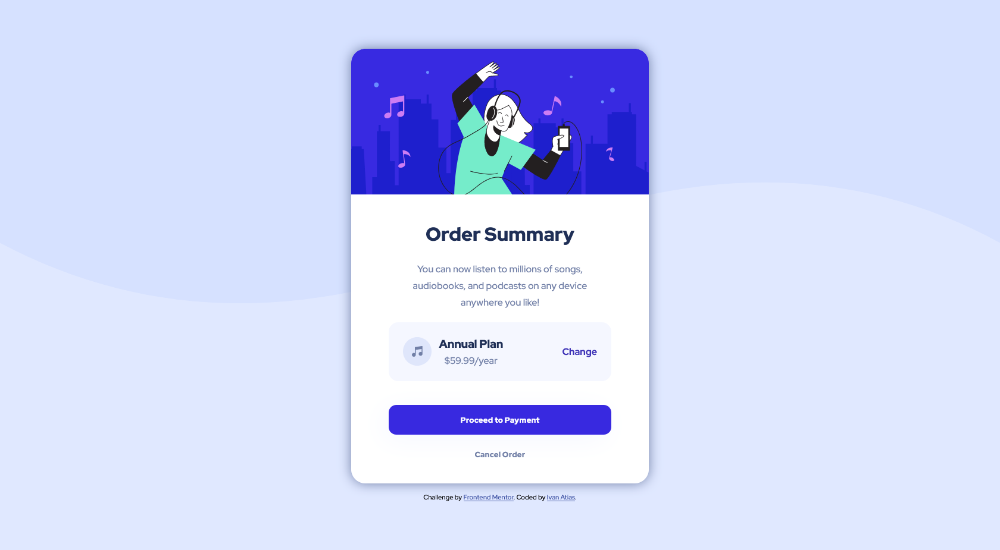

# Frontend Mentor - Order summary card solution

This is a solution to the [Order summary card challenge on Frontend Mentor](https://www.frontendmentor.io/challenges/order-summary-component-QlPmajDUj). Frontend Mentor challenges help you improve your coding skills by building realistic projects.

# Screenshot

# Built with

- Semantic HTML5 markup
- CSS custom properties
- Flexbox
- CSS Grid

# Author

- Website - [Ivan Atias](https://www.ivanatias.dev)
- Frontend Mentor - [@ivanatias](https://www.frontendmentor.io/profile/ivanatias)
